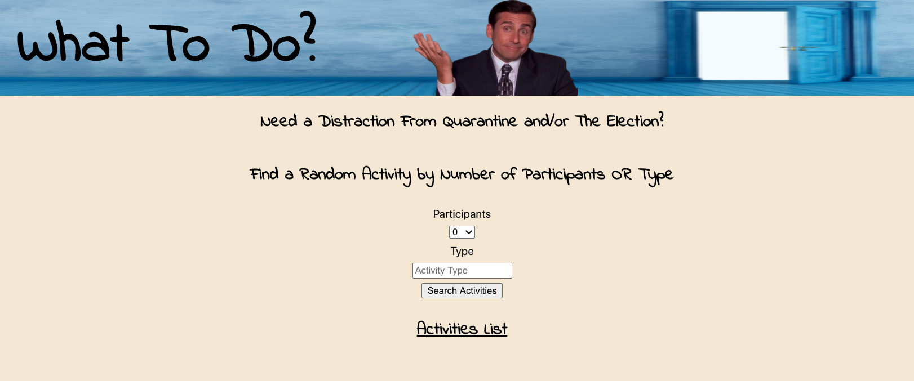
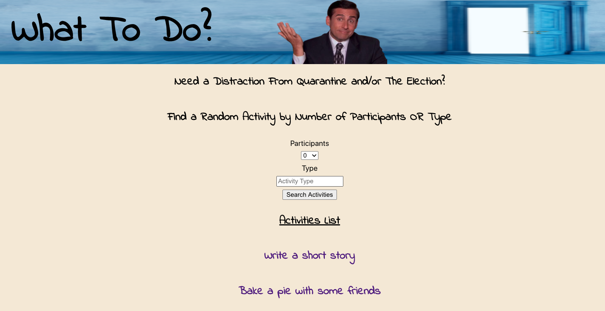
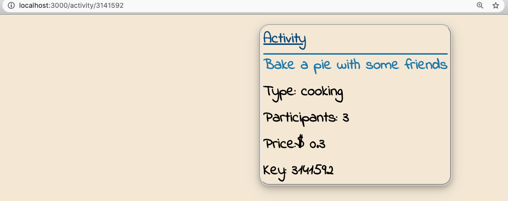

## About The Project

This project was created using [Create React App](https://github.com/facebook/create-react-app).

This solo project is part of Turing Software and Designs' Front-End Program, Module 3. The project focuses on creating an original application using React. It implements ES6 syntax and Router into our React application. One database was accessed, representing a large chunk of data for random activities a user could do. The database is accessed with and without parameters. My task was to create an application that gave the user random activities to do during quarantine. Each activity contains a type, number of participants, price, and key (for verification). This program also incorporates the use of the React/Jest testing libraries.

### Getting Started with Create React App

### Installation Setup
In your terminal:
1. Clone the repo- git@github.com:ericberglund117/what-to-do.git

2. Install NPM packages- `npm install`

3. Start application- In the project directory, you can run:

#### `npm start`

Runs the app in the development mode.\
Open [http://localhost:3000](http://localhost:3000) to view it in the browser.

The page will reload if you make edits.\
You will also see any lint errors in the console.

#### `npm test`

Launches the test runner in the interactive watch mode.\
See the section about [running tests](https://facebook.github.io/create-react-app/docs/running-tests) for more information.

### Built With

* React
* Router
* React/Jest Testing libraries

## Usage

#### Homepage

#### Homepage with Activities

#### Activity card

## Roadmap

The total time allotted for this project was approximately 5 days. Future features contemplated by the developer includes the following:

* Allowing a user to favorite their activities and then view their favorited activities on a different page.
* Allow the user to comment on an activity card.
* Allow the user to share their favorited activities with friends.

## Contact

 [Eric Berglund](https://github.com/ericberglund117)

Project Link: [What-To-Do Repo](https://github.com/ericberglund117/what-to-do)

## Acknowledgements

Khalid Williams - This developer would like to thank Turing Module 3 instructor, Khalid Williams, for his assistance throughout this project and for his daily lessons on the magic of React.

Leta Keane - We would also like to thank Turing Module 3 instructor, Leta Keane, for her guidance and assistance on this project and the module in general.
